# AW Hub

**English** | [Bahasa Indonesia](README.id.md)

A *self-hosted* dashboard that combines [ActivityWatch](https://activitywatch.net) data from several laptops
in one place. An independent project, not an official part of ActivityWatch.

<picture>
  <source media="(prefers-color-scheme: dark)" srcset="docs/screenshots/dashboard-overview-dark.png">
  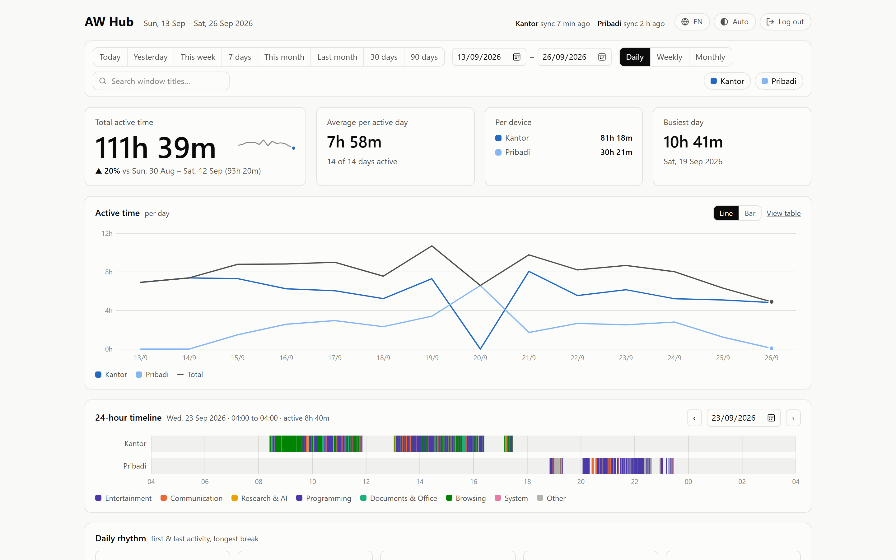
</picture>

**Key features**

- Total active time per laptop, comparison with the previous period, daily/weekly/monthly trends
- 24-hour timeline, daily rhythm (start, finish, longest break), day × hour heatmap
- Activity categories you can edit from the dashboard, **work vs personal** insight (overtime, weekends)
- Click to filter every chart, search window titles
- Automatic weekly summary to **Telegram**
- Light/dark mode, English/Indonesian UI, installable as an app (PWA)
- Login with attempt limits, strict CSP, dependency-free agent (Python standard library only)

## Screenshots

<table>
  <tr>
    <td width="50%">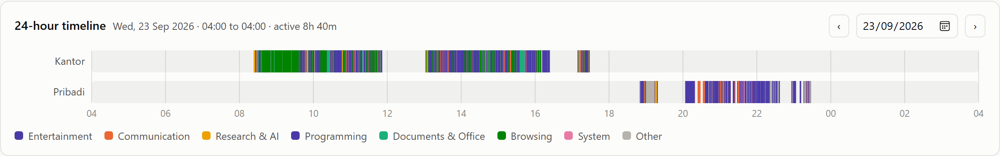</td>
    <td width="50%">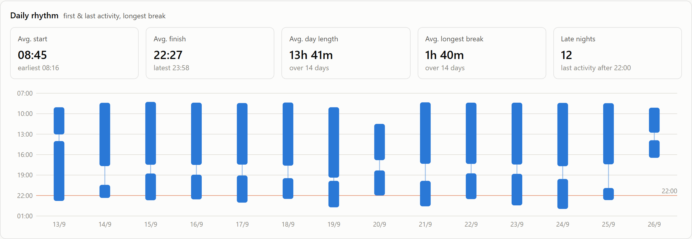</td>
  </tr>
  <tr>
    <td>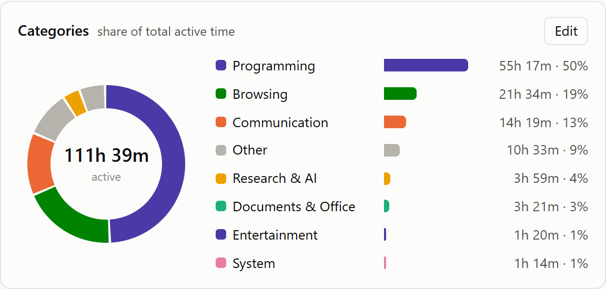</td>
    <td>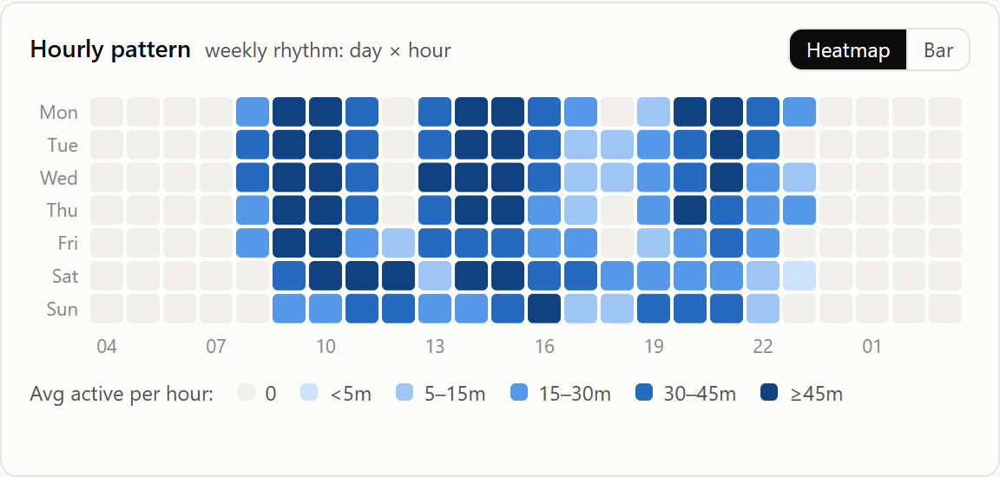</td>
  </tr>
  <tr>
    <td>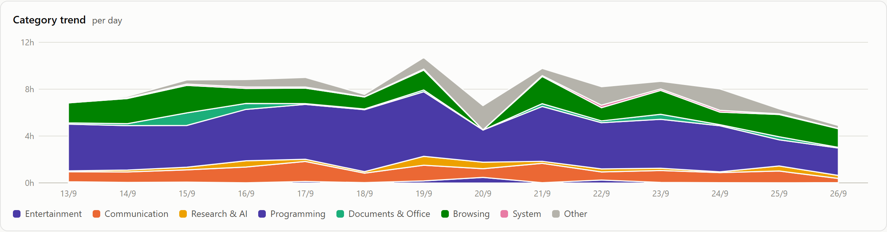</td>
    <td>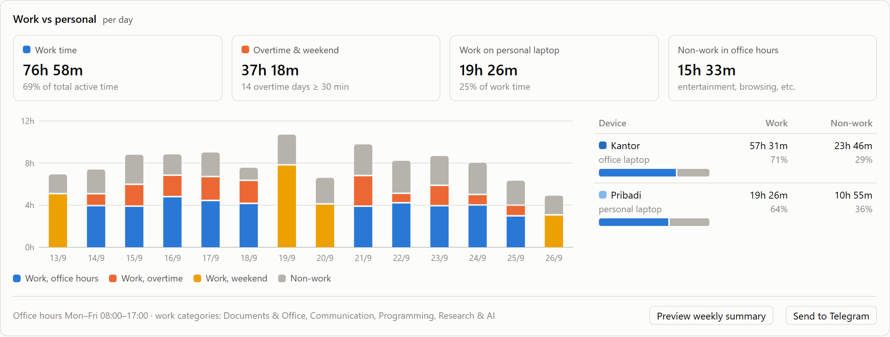</td>
  </tr>
  <tr>
    <td>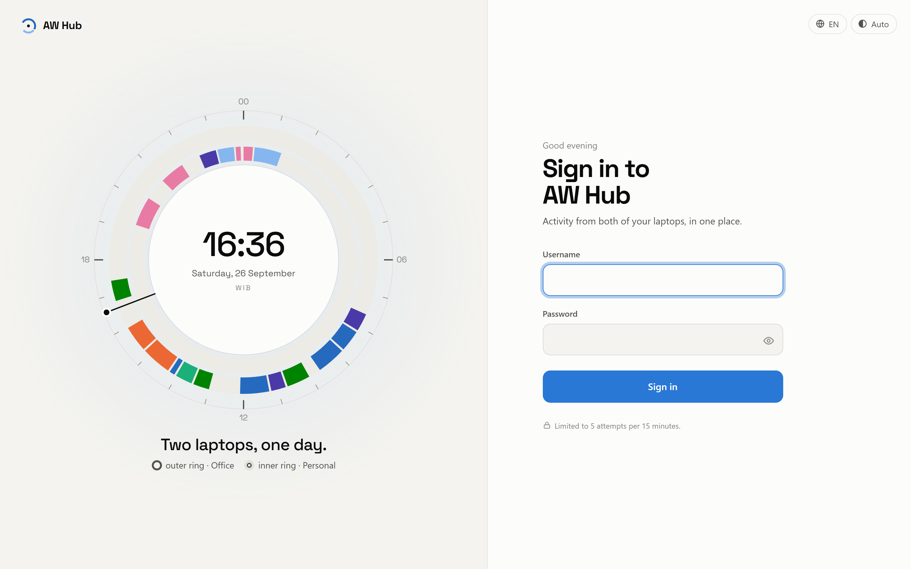</td>
    <td>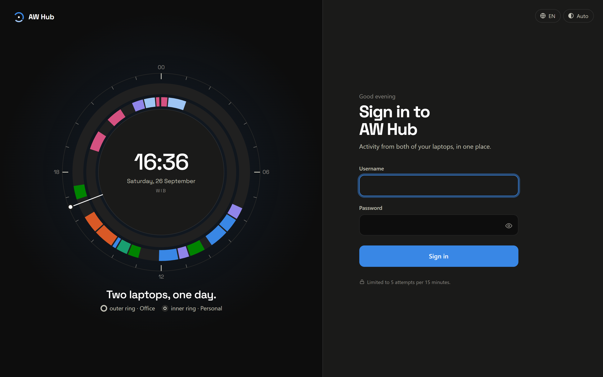</td>
  </tr>
</table>

Full-page view: [light](docs/screenshots/dashboard-full-light.png) · [dark](docs/screenshots/dashboard-full-dark.png).
Window titles in the screenshots are intentionally blurred.

## How it works

```
Office laptop   ─┐  agent (every 15 min, HTTPS + token)
                 ├──►  Linux server: FastAPI + SQLite ──► dashboard (login)
Personal laptop ─┘
```

- Each laptop keeps running ActivityWatch as usual, so activity is still recorded while offline.
- The **agent** takes window events that overlap the *not-afk* status. This is the same query the ActivityWatch
  web UI uses, so "active time" numbers match. The agent then sends the data in 1-day chunks.
  The server **replaces** the data for that chunk, so re-sending never creates duplicates.
  If the server is unreachable, the agent simply tries again on the next run.
- **Dashboard:** total active time and comparison with the previous period, daily/weekly/monthly charts
  per laptop, 24-hour timeline, categories, hourly pattern, top applications, and top window titles.
  Any date range works. Filters are stored in the URL, so views can be bookmarked.

## 1. Server (Linux, Docker)

Requirements: Docker + the compose plugin, and a domain/subdomain with an A record pointing to the server's public IP.

```bash
git clone <this-repo> aw-hub && cd aw-hub
cp .env.example .env
openssl rand -hex 32          # → AW_HUB_INGEST_TOKEN
nano .env                     # set domain, token, dashboard password
```

There are two options, depending on whether ports 80/443 on the server are already in use:

- **nginx already runs on the host** (e.g. behind Cloudflare): `docker compose up -d --build`.
  The app only listens on `127.0.0.1:8077` (change it with `AW_HUB_PORT`). Install the vhost from
  `deploy/nginx-aw-hub.conf`.
- **Ports 80/443 are free:** `docker compose --profile caddy up -d --build`.
  Caddy takes care of Let's Encrypt HTTPS for `AW_HUB_DOMAIN` automatically.

Open `https://<domain>` and sign in with `AW_HUB_DASH_USER` / `AW_HUB_DASH_PASSWORD`.
Sign-in is limited to **5 failed attempts per IP per 15 minutes**. Each subsequent lockout doubles, up to 24 hours.
There is also a global limit of 30 failures per 15 minutes across all IPs. It protects against distributed attacks,
at the cost of temporarily blocking your own sign-in during such an attack. Sessions last 30 days.
Changing the password signs out every session.

`AW_HUB_DASH_PASSWORD` can hold a plain password **or a bcrypt hash** (recommended, because the real password is
then never stored on the server). To create a hash:

```bash
docker compose exec app python hashpw.py      # type the password (not echoed)
```

Paste the result into `.env` **in single quotes**, i.e. `AW_HUB_DASH_PASSWORD='$2b$12$...'`, then run
`docker compose up -d`. Without quotes, Docker Compose treats `$` as a variable and corrupts the hash. In that case
the server refuses to start and prints a message explaining the problem.
The database lives in `./data/aw-hub.db`. To back it up, just copy that file.

### Without Docker (you already run nginx/caddy)

```bash
cd aw-hub/server
python3 -m venv .venv && .venv/bin/pip install -r requirements.txt
set -a; . ../.env; set +a
.venv/bin/uvicorn app:app --host 127.0.0.1 --port 8000 --proxy-headers
```

The frontend must be built first (`cd web && npm ci && npm run build`); the server serves `web/dist`.
Create a systemd unit with `EnvironmentFile=/path/aw-hub/.env`, then reverse-proxy HTTPS to `127.0.0.1:8000`.

## 2. Agent on each laptop

Requirement: Python 3.9+. The agent only uses the Python standard library, so no `pip install` is needed.

**Windows** (PowerShell, from the `agent/` folder):

```powershell
.\install-windows.ps1 -ServerUrl https://aw.example.com -Token <AW_HUB_INGEST_TOKEN> -DeviceName Office
```

The script creates `config.json` and an **AW Hub Agent** Scheduled Task that runs every 15 minutes and at sign-in.
The first run uploads the whole history. For example, ±75 days takes about 7 minutes because queries in aw-server
are slow. Later runs take about 15 seconds. To remove the task: `.\install-windows.ps1 -Uninstall`.

**Linux (systemd)**, from the `agent/` folder:

```bash
./install-linux.sh --server https://aw.example.com --token <AW_HUB_INGEST_TOKEN> --device Personal
```

The script creates `config.json` and an `aw-hub-agent.timer` systemd *user* timer that runs every 15 minutes
while you are logged in. Runs missed while the laptop was asleep are executed as soon as it wakes up.
The initial sync starts right away. Status: `systemctl --user list-timers | grep aw-hub`,
last run log: `journalctl --user -u aw-hub-agent -n 20`. To remove: `./install-linux.sh --uninstall`.

> **Wayland:** ActivityWatch's built-in `aw-watcher-window` does not record windows under Wayland
> (the default on GNOME, Debian 12+). Use [awatcher](https://github.com/2e3s/awatcher) or an Xorg session.

**macOS / no systemd:** copy `config.example.json` → `config.json`, then schedule it with cron:
`*/15 * * * * /usr/bin/python3 /path/aw-hub/agent/aw_hub_agent.py`.

`config.json` options:

| Key | Description |
| --- | --- |
| `device_name` | Laptop name on the dashboard (e.g. `Office`, `Personal`). Do not change it once data has been sent. |
| `hide_title_regex` | Window titles of matching apps/titles are replaced with `(disembunyikan)` before sending, e.g. `"outlook\|teams\|sap"`. |
| `aw_url` | Local aw-server address, default `http://localhost:5600`. |

Manual commands: `python aw_hub_agent.py` (normal sync), `--days 30` (re-send the last 30 days),
`--full` (re-send everything). The log is written to `agent/aw-hub-agent.log`.

## 3. Categories

**Easiest:** click **Edit** on the *Categories* card in the dashboard. There you can change names, colors, order,
and regexes; set work hours and work days; and **test the rules** against the last 30 days of data. Apps or titles
without a category can be added to a category right away. Edited rules are stored in `data/categories.json` on the
server, so deploys never overwrite them. *Reset to default* goes back to the file in the repo.

<p align="center">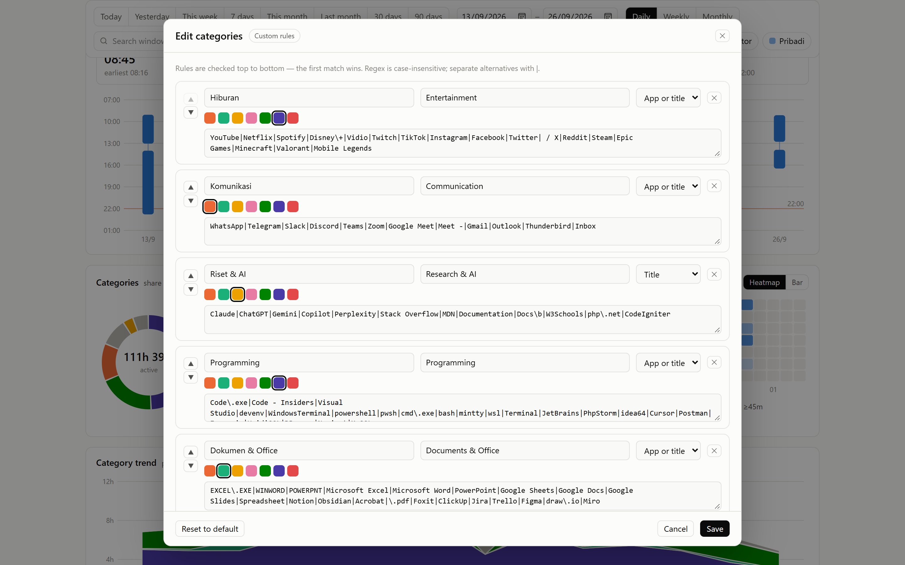</p>

Manually: edit `config/categories.json`. Rules are checked top to bottom and the first match wins.
`match` can be `app`, `title`, or `both`, and `slot` (2–8) is the category's fixed color.
`name_en` is the English label shown when the UI is in English.
The server reloads this file automatically, so a dashboard refresh is enough. Categories are computed when the
dashboard loads, so rule changes also apply to old data.

## 4. Work vs personal insight

Configure the `work` section in `config/categories.json` (category names refer to the `name` field):

```json
"work": {
  "categories": ["Programming", "Dokumen & Office", "Riset & AI", "Komunikasi"],
  "days": [0, 1, 2, 3, 4],
  "start_hour": 8, "end_hour": 17,
  "office_devices": ["Kantor"]
}
```

The dashboard shows:
- total work time;
- overtime (work outside office hours) and weekend work;
- work done on laptops other than `office_devices`;
- non-work activity during office hours;
- a device × work/non-work matrix.

Office hours are evaluated per local hour, and hours 00–03 belong to the next calendar day.

## 5. Weekly Telegram summary

1. Create a bot with [@BotFather](https://t.me/BotFather) and note its token.
2. Send any message to the bot, then open `https://api.telegram.org/bot<TOKEN>/getUpdates` to find `chat.id`.
3. Set `AW_HUB_TELEGRAM_BOT_TOKEN` and `AW_HUB_TELEGRAM_CHAT_ID` in `.env`, then run `docker compose up -d`.

The server sends last week's summary (Monday–Sunday) every **Monday at 07:00** (change it with
`AW_HUB_REPORT_WEEKDAY` / `AW_HUB_REPORT_HOUR`). Weeks already sent are recorded in the database,
so restarting the server never sends a report twice. From the *Work vs personal* card in the dashboard,
the report can be **previewed** or **sent now**.

## 6. Filters & search

Click a category (in the list or the donut), an application, a timeline segment, or a window title to filter
**every** chart. Click the same item again, or the × on the filter chip, to clear it. The search box searches
window titles. Filters are stored in the URL, so filtered views can be bookmarked.

<p align="center">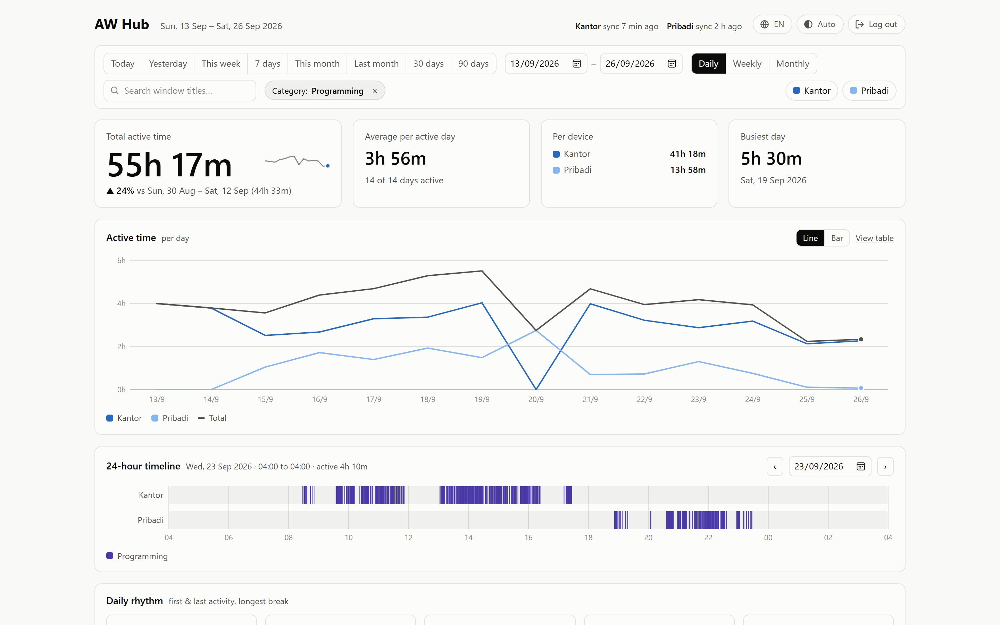</p>

## 7. Daily rhythm

The *Daily rhythm* card shows each day's start and finish (first and last activity), day length,
longest break (gaps ≥ 5 minutes), and the number of *late nights* (last activity after 22:00).
Days with less than 5 minutes of activity are ignored.

## 8. Install as an app (PWA)

In Chrome/Edge (desktop or Android) choose **Install app**. On iPhone, use **Share → Add to Home Screen**.
The service worker only caches icons and the offline page. Data and dashboard pages are **never** cached,
so personal data is not stored on the device.

**Updates are automatic.** Every build gets a unique build ID. Opening or refreshing the app always loads the
latest version, and an app that stays open (e.g. on a phone) checks for a new version every 10 minutes and when it
becomes active again, then shows *"A new version of AW Hub is available"* with a **Reload** button. Nothing reloads
on its own, and filters survive the reload because they live in the URL.
Icons and the favicon are generated with `python deploy/make-icons.py` (requires Pillow).

<p align="center">
  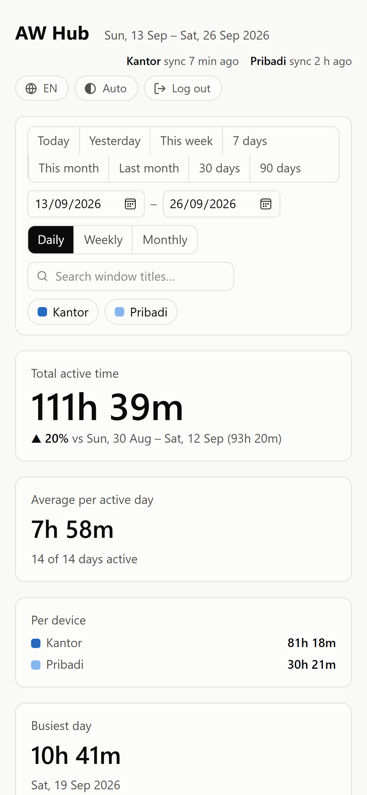
  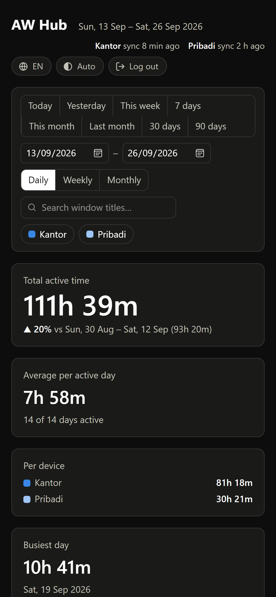
  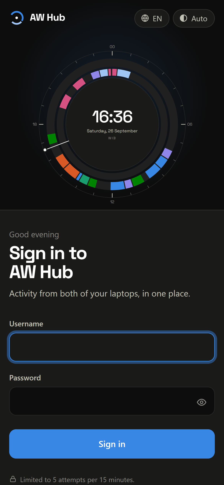
</p>

## 9. Language (EN / ID)

The dashboard and sign-in page are available in English (default) and Indonesian. Switch with the 🌐 button
in the top-right corner. The choice is stored per browser. Category names use `name_en` from
`config/categories.json` while English is active.
The Telegram summary language is set separately with `AW_HUB_REPORT_LANG` (`en` | `id`).

<p align="center">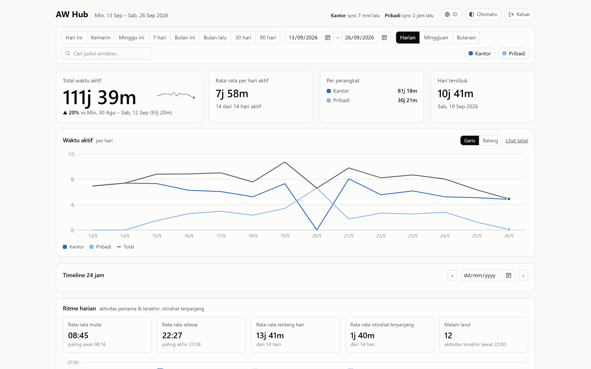</p>

## 10. Frontend development

The frontend lives in `web/` (Astro + TypeScript + Tailwind CSS). Its build output is static files served by
FastAPI, so there is no Node server in production (the Docker image builds it in a separate stage).

```bash
cd web
npm ci
npm run dev        # http://localhost:4321, /api is proxied to the local FastAPI on :8765
npm run typecheck  # tsc --noEmit (strict)
npm run build      # → web/dist (used automatically by a local server)
```

## Security notes

- The dashboard is exposed to the internet and protected by a login with attempt limits. Use a long password.
  For extra protection, put Cloudflare Access in front of it and exclude `/api/ingest`.
- Window titles can contain sensitive data (file names, email subjects). Use `hide_title_regex` on work laptops
  and make sure this complies with your employer's policy.
- The agent token can only write data. `AW_HUB_INGEST_TOKEN` may hold several comma-separated tokens, so a token
  can be rotated without interrupting sync: set `new,old`, update `config.json` on every laptop, then remove the old one.
- Change the dashboard password with `deploy/set-password.sh`, and other secrets (e.g. the Telegram bot token) with
  `deploy/set-secret.sh`. Both prompt for the value in the terminal, so it never ends up in shell history.

## License

[MIT](LICENSE) © 2026 Ahmad Pausi
